# Limestone: An interactive chatbot

<center>


Limestone is a personalized and highly customizable Telegram bot that allows you to interact with a local or cloud instance of an LLM.

</center>

## Project Overview

This project aims to provide an accessible way to interact with GPT-based Language Models. By utilizing Telegram as a frontend, we ensure secure messaging and protect user data from potential leaks. The project enables users to run their Language Models privately and securely as long as you trust Telegram as a platform.

## Getting Started

### Installation

1.  Set up and launch [SGLang](https://github.com/sgl-project/sglang) or your preferred backend with your preferred model and configuration.

2.  Clone the repository:

```bash
git clone https://github.com/bkutasi/limestone
```

3.  Create a new virtual environment (Python 3.13)

```bash	
pyton -m venv env
source env/bin/activate
```

4.  Install required packages

```bash
pip install -r requirements.txt
```

5.  Create a Telegram bot and obtain the token through [BotFather](https://telegram.me/BotFather). Additional bot documentation is available [here](https://core.telegram.org/bots#6-botfather) and [here](https://core.telegram.org/bots/tutorial). Then make your config.yaml file based on the config.example.yml file

### Server Launch

```bash
python main.py
```

Note: Server-side encryption is not implemented. Not recommended for production use without proper security measures.

## Logging

Limestone uses the Python `logging` module to provide detailed information about the bot's operation. Understanding the different log levels can help you debug issues or monitor the bot's activity.

**Log Levels:**

**DEBUG** | **INFO** | **WARNING** | **ERROR** | **CRITICAL** 

**Adjusting the Log Level:**

The default log level is set to `INFO` to reduce excessive logging.

Specifically, the `httpx` logger has is levels set to `WARNING` to filter out the verbose `INFO` level HTTP request logs.

## Supported Models

For models, pick your choice form [Open LLM leaderboard](https://huggingface.co/spaces/HuggingFaceH4/open_llm_leaderboard)

## Architecture

```mermaid
%% Limestone Chatbot Architecture Diagram - Dark Theme
graph TD
    subgraph Telegram Ecosystem
        A[Telegram Client] -->|Send Message| B(Telegram API)
        B -->|Update| C[Bot Application]
        C -->|Response| B
    end

    subgraph "Limestone Core (main.py)"
        C -->|Command| D[Command Handler]
        C -->|Message| E[Message Handler]
        E -->|Generate Response| F[LLM Client]
        E -->|Update History| G[(Conversation Memory)]
    end

    subgraph ExternalServices
        F -->|API Call| H[(LLM Backend)]
        H -->|Streaming Response| F
    end

    subgraph Configuration
        I -->|Reload Config| C
        K -->|Reload Logging config| C
        K[Logging Watcher] -->|Monitor| J[logging.yml]
        I[Config Watcher] -->|Monitor| L[config.yml]
    end

    subgraph Helpers
        E --> M[Error Helper]
        E --> N[Formatting Helper]
        E --> O[Message Helper]
        D --> M
    end

    %% Dark Theme Styles
    style ExternalServices fill:#455a64,stroke:#b0bec5
    style Configuration fill:#263238,stroke:#b0bec5
    style Helpers fill:#37474f,stroke:#b0bec5
    classDef component fill:#424242,stroke:#b0bec5,color:#fff;
    class A,B,C,D,E,F,G,H,I,J,K,L,M,N,O component
```



## Development Roadmap

### Short Term

-   Streaming implementation (Completed)
-   Multiple personalities (In Progress)
-   Code cleanup and refactoring (2/5 pass complete)
-   Conversation history implementation (2/5 pass complete)
-   Model testing and integration
-   Performance optimization
-   Long-term memory implementation
-   OpenResearch integration ([ref](https://github.com/TheBlewish/Automated-AI-Web-Researcher-Ollama))
-   Testing and CI/CD implementation
-   User whitelisting system

### Medium Term

-   API integration for document retrieval and search
-   Langchain integration
-   Vector database implementation
-   Concurrent request handling (Completed)

### Long Term

-   Public deployment with token/message limitations

## Technical Limitations

Current LLM limitations include:

-   Potential for generating incorrect or inconsistent responses
-   Limited common sense reasoning
-   Knowledge constraints based on training data
-   Potential training data biases
-   Limited emotional understanding
-   Context interpretation challenges

## Acknowledgements

-   [LLaMA](https://github.com/facebookresearch/llama)
-   [Self-instruct](https://github.com/yizhongw/self-instruct)
-   [Alpaca](https://github.com/tatsu-lab/stanford_alpaca)
-   [Vicuna](https://github.com/lm-sys/FastChat)
-   [Oobabooga](https://github.com/oobabooga)
-   Additional upcoming models
-   Community contributors
